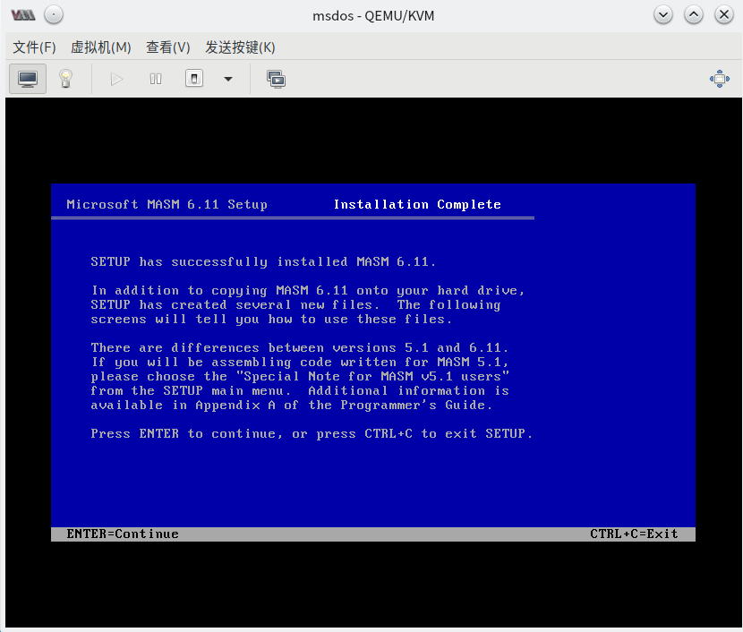
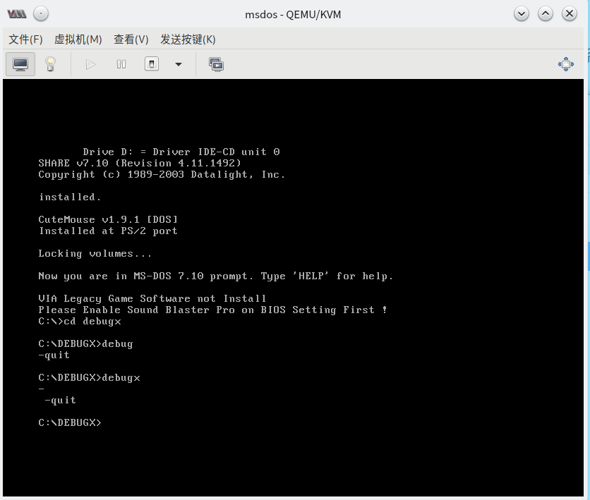

 # 1.2 安装编译器、调试器和连接器

## 编译器 MASM 、 连接器 LINKER

#### 挂载虚拟机镜像到实体机 （以 KVM 为例）

KVM 的默认磁盘镜像存储位置： `/var/lib/libvirt/images`

为了创建快照，我们在之前创建虚拟机时选择保持默认磁盘格式，即 `*.qcow2` 。由于我们目前能够下载的工具包均是已经解开的非磁盘镜像文件，我们需挂载磁盘以进一步写入文件。

请注意，下列命令中任何路径 **<u>必须</u>** 为 **<u>绝对路径</u>**

```bash
# lsmod | grep nbd      // 检查所需内核模块是否挂载
# modprobe nbd          // 挂载需要的内核模块
# qemu-nbd --connect=/dev/nbd0 /path/to/qcow2/image  // 将镜像挂载为 Block 设备 （添加 --readonly 以保持只读）
# fdisk /dev/nbd0 -l    // 检查镜像的分区
# mkdir /media/mountpoint    // 创建挂载点
# mount /dev/nbd0p1 /media/mountpoint   // 将分区挂载到挂载点
```

解除挂载并断开设备连接：

```bash
# umount /media/mountpoint       // 解挂载
# qemu-nbd --disconnect /dev/nbd0     // 断开设备连接
```

### 开始安装

打开文件管理器，新建一个文件夹，将安装包解压进去。如果你在 Linux 下操作，请注意，你需要使用 ROOT 权限 才能对挂载的文件系统进行读写。 写入完成后请务必解除挂载并断开设备连接，其他不再赘述。

接下来，请你使用 `cd` 等命令切换到安装文件目录，根据文字提示进行进一步安装。



本教程提供的 `MASM` 为完整版本，携带了 `link.exe` ，无需独立安装连接器。

最终目录结构如图所示：


### 安装完成





## 调试器 DEBUGX

本教程提供的 `DEBUGX` 为 原 DOS 中 `DEBUG` 程序的进阶修改版，直接将解压后得到的文件放入一个文件夹中，并复制到 DOS 系统根目录即可直接运行，无需安装。

## Windows 下 Visual Studio 配置

请安装一个 Visual Studio，本人使用了 VS 2017 Enterprise 版本，支持正版，从我做起！

只需安装所有 C++ 支持即可，无需安装 Windows 10 SDK, 请在安装完成之后新建一个 新的 **Windows 控制台应用程序项目** 以继续我们的实验和教程。

新建完成后，请引入 Git 版本管理系统，并 **关闭 使用预编译头(stdafx.h) ** 选项后按照下图指示配置项目。


## 请完成实验一

## 本章完

欢迎您在本文下方评论区留言与大家共享您的想法，联系作者请前往 Github 开启 Issue。
