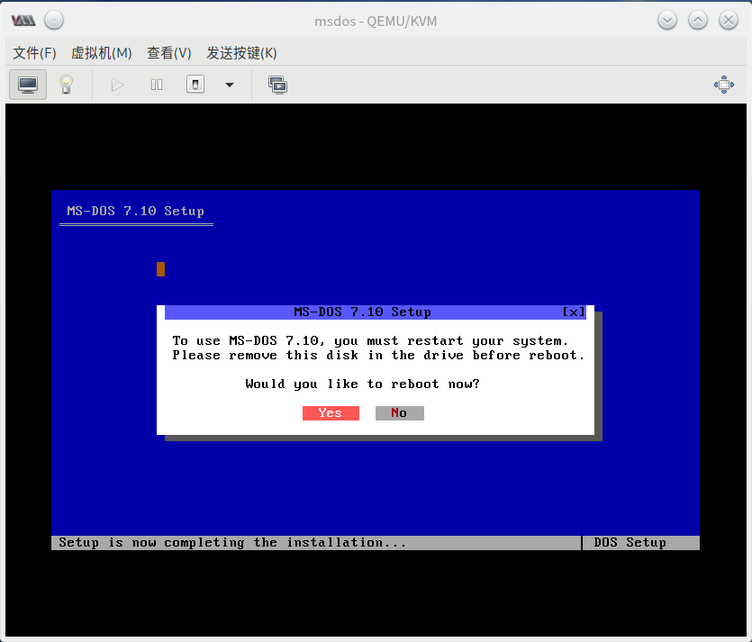
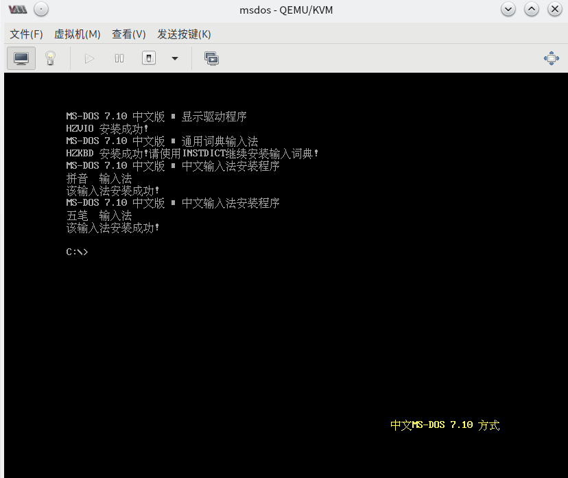

# VM 安装设定

## 创建虚拟机

关键设置清单：(以 KVM 为例)

|    设置名    |              值              |
| :----------: | :--------------------------: |
| 固件及芯片组 |        BIOS - i440FX         |
|     CPU      |             486              |
|     RAM      |             128M             |
|    存储器    | 全部设置为IDE，从ISO启动安装 |
|     显卡     |             VGA              |
|     声卡     |             AC97             |

启动安装程序，一路下一步。

### 分区

到分区这一步，选择 “使用安装程序创建FAT16/32分区”，接下来系统重启。

这时候安装程序会自动弹出安装镜像，此时请重启完成之后关闭虚拟机，手动再次挂载安装镜像并修改引导顺序、启用引导菜单。


接下来启动虚拟机，按下 Esc 并选择从光盘启动，继续下一步安装。

### 安装

一路下一步之后，我们选择安装可选插件，来到声卡驱动界面，上下左右调整到对应位置，空格选中，选择 ```VIA AC97``` 下一步。


一路下一步之后，我们来到启动日志产生界面，一般不会有太大问题，选择不生成。


由于长文件名支持不够完善，并可能导致文件丢失，为了防止数据丢失，DOS 的解决方案是禁用直接 I/O 。询问是否启用直接 I/O，由于个人一般没有使用超长文件名的习惯，基于性能考虑，选择启用。


**关键的一步**： 选择启用扩展内存！如图所示。


一路下一步，接下来到了配置启动项，全部勾选后继续。


配置键盘布局，保持默认。

安装完成。此时，请前往虚拟机配置处断开 ROM 的 ISO 连接后重启。





重启后会提示在 BIOS 中开启 Sound Blaster 声卡，由于 Sound Blaster 声卡已经被 **DEPRECATED** ，我们不做任何操作，保持 AC97 。


### 启动成功

中文支持： 输入 ```ccdos``` 或 ```pdos``` 启动中文支持。




启动完成。

啥？你告诉我不会关机？ 输入 ```shutdown```，完事。