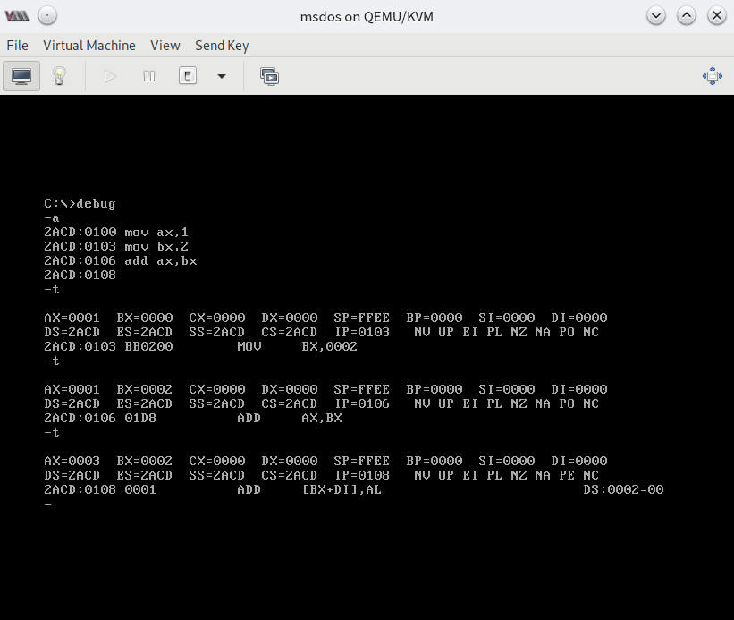

# 实验一：DOS 中 ```DEBUG``` 的基本使用

写在前面： 这里我们使用一个功能完全相同，但有一些进阶支持的 ```DEBUGX``` 来替代 ```DEBUG``` 完成这个实验。

## 实验目的

熟悉 ```DEBUG``` 的基础应用。

## 实验准备

一台 装有 MS-DOS 的计算机。

## 实验背景知识

- DEBUG 功能一览表：

| Commands | Features |
| :----------: | :------: |
| R | 查看、修改CPU寄存器中的内容 |
| D | 查看内存中的内容 |
| E | 改写内存中的内容 |
| U | 将内存中的机器指令翻译成汇编指令 |
| T | 执行一条机器指令 |
| A | 以汇编指令格式，在内存中写入一条机器指令 |
| P | 用于执行循环、中断或追踪 |

- 8086 CPU 地址空间分配的基本情况

| 地址段 | 用途 |
| :---: | :---: |
| 00000 ~ 9FFFF | RAM地址空间 |
| A0000 ~ BFFFF | 显存地址空间 |
| C0000 ~ FFFFF | Read-Only Memories |

## 预实验

1. 根据上述操作说明进行自主尝试
2. 完成下列习题

## 实验习题

（1） 将下列程序段使用 A、E等指令写入内存，逐条执行，观察各种寄存器（CS、IP等）的变化。

```
机器码      汇编指令
B8 20 4E   MOV AX, 4E20H
05 16 14   ADD AX, 1416H
BB 00 20   MOV BX, 2000H
01 D8      ADD AX, BX
89 C3      MOV BX, AX
01 D8      ADD AX, BX
B8 1A 00   MOV AX, 001AH
BB 26 00   MOV BX, 0026H
00 D8      ADD AL, BL
00 DC      ADD AH, BL
00 C7      ADD BH, AL
B4 00      MOV AH, 0
00 D8      ADD AL, BL
04 9C      ADD AL, 9CH
```

（2）在 起始地址为 2000:0 的 连续地址单元中，写入下列指令

```
MOV AX, 1
ADD AX, AX
JMP 2000:0003
```

（3）向内存从 B8100H 开始的单元中填写数据

```
-e B810:0000 01 01 02 02 03 03 04 04
```

（4） PC机主板的 ROM 上写有一个生产日期，在内存 FFF00H ～ FFFFFH 的某几个单元中，请尝试找到这个生产日期并试图改变它。（PS. 都说了 ROM，怎么可能改变......）

## 实验数据及结果

此处仅展示部分指令执行的结果，不会展示任何习题相关内容，以后的实验均遵循此惯例。


向内存中写入汇编指令并执行


读取内存段中的机器指令


直接修改机器指令


读取寄存器中的内容


按序执行指令


以汇编形式显示寄存器中的指令


胡乱修改后报错

## 实验分析与反思

请复习以上涉及的部分，根据结果，提出自己的想法，欢迎你发表在评论区。


