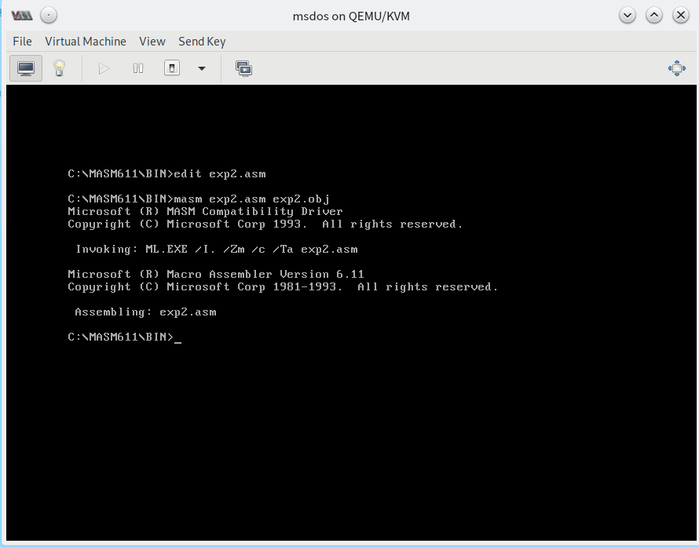

# 实验二：编程、编译、链接、跟踪 ⭐️

## 实验目的

通过之前的理论铺垫，请你通过这个实验完成一次汇编语言从源码到执行的过程，并使用 ```DEBUG``` 跟踪可执行文件的运行过程。

## 实验题目

根据 [源码](../assets/code/exp2.asm)，进行编译、连接、运行，并通过 ```DEBUG``` 追踪，查看 PSP 中的内容。

提示：PSP 中的 头两个字节是 ```CD 20``` 。

## 实验结果记录

  写入源代码

  编译

  链接

  调试并查看 PSP

## 实验反思交流

请在下方提出你的疑问、观点、看法。