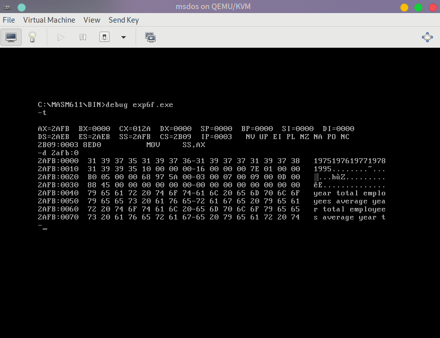

# 实验六：结构化数据访问应用

## 实验目的

熟悉 4.1 ～ 4.4 和 3.6 的内容，完成下列习题。

## 实验要求

按照下列格式，将下表中的数据从预定义好的 DATA 段保存到 TABLE 段，空格分隔，并计算人均收入保存到 TABLE 段。

数据格式：

| 行内偏移地址 | 0123 | 4 | 5678 | 9 | AB | C | DE | F |
| :--------: | :----: | :----: | :----: | :----: | :----: | :----: | :----: | :----: |
| table:[n* 10H] | [BEGIN] Years (4 Bytes) | Space (1 Byte) | Salary (4 Bytes) | Space (1 Byte) | Employees (2 Bytes) | Space (1 Byte) | Average Salary (2 Bytes) | Space (1 Byte) [END] |

## 实验提示

1. DATA 段中的数据可以看作一个个数组
2. TABLE 段中的数据可以看作一个结构体数据，每个结构型数据包含多个数据项。
3. 对于 TABLE 段中数据的访问，我们可以使用类似这样的格式来完成。 Example: `[bx].idata[si]`
   这里我们用 bx 来 定位 段中的每一个结构体， 用 idata 来 定位 结构体中的每一个数据项， 用 si 来定位 数据项中的每一个元素。

## 实验数据

[ ASCII ENCODED ]

1975 - 31 39 37 35 ASCII(HEX)  BYTES

1976 - 31 39 37 36 ASCII(HEX)  BYTES

1977 - 31 39 37 37 ASCII(HEX)  BYTES

1978 - 31 39 37 38 ASCII(HEX)  BYTES

1995 - 31 39 39 35 ASCII(HEX)  BYTES

L -> H  [ DIRECT ]

16 00 00 00 DOUBLE WORD

7E 01 00 00 DOUBLE WORD

B0 05 00 00 DOUBLE WORD

68 97 5A 00 DOUBLE WORD

L -> H  [ DIRECT ]

03 00 WORD

07 00 WORD

09 00 WORD

0D 00 WORD

88 45 WORD

## 预定义数据及代码

[点击此处查看预定义的实验数据与实验代码](../assets/code/exp6.asm)

## 实验结果

[点击此处查看完整实验代码](../assets/code/exp6f.asm)

## 实验反思

通过这次实验，你学习到了那些实践技巧，注意到哪些你之前没有注意到的细节问题，有哪些地方经过这次实验得到巩固或产生了更多的疑问？欢迎在讨论区中与我们交流。
