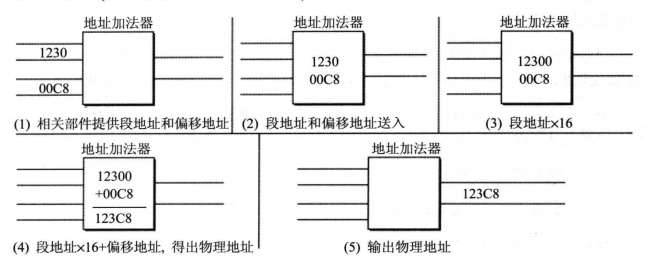

# 2.2 汇编基础：CPU 寻址

## 课程准备

我们前面说到 8086 CPU 架构中 存在 AX、BX、CX、DX 几个寄存器，且每个寄存器均为 16 位，分为高8位和低八位，即 AH+AL, BH+BL, CH+CL, DH+DL，每个寄存器可以存储两个字节，下面的示例中所有数据均以 16进制 表示。

这里默认你已经学习了《计算机组成结构和原理》中相关的寻址方法内容，仅对一些特定的CPU寻址过程中虚地址到实地址的转换进行一定的介绍。

## 基础知识

### 历史背景： 8086 CPU 的 工作模式

我们知道 CPU 需要处理数据时，必须通过寻址来查找对应数据在存储器中的地址。

	早年的 8086 CPU 有且只有实模式一种工作模式，而从 80286 开始就有了保护模式，从 80386 开始 CPU 数据总线和地址总线均为 32 位，而且寄存器都是 32 位。但 80386 以及现在的奔腾、酷睿等等 CPU 为了向前兼容都保留了实模式，现代操作系统在刚加电时首先运行在实模式下，然后再切换到保护模式下运行。
	CPU 中的 IP（EIP） 中存放虚地址，把虚地址转换到物理地址，各个模式有各自的转换方式。
	实模式下，虚地址到实地址转换：DS 段寄存器左移4位与偏移地址相加，得到物理地址，寻址1M。
	保护模式下，虚地址到实地址转换经过 MMU（内存管理单元），也就是分段与分页机制，寻址4G。
	保护有两层含义：
	1、任务间保护：多任务操作系统中，一个任务不能破坏另一个任务的代码，这是通过内存分页以及不同任务的内存页映射到不同物理内存上来实现的。
	2、任务内保护：系统代码与应用程序代码虽处于同一地址空间，但系统代码具有高优先级，应用程序代码处于低优先级，规定只能高优先级代码访问低优先级代码，这样杜绝用户代码破坏系统代码。这是通过段式管理来实现，4GB虚拟内存中，代码数据和堆栈各占有一个段，段是一个独立有意义的内存单元，有基地址和边界以及本段的优先级，Windows系统有两个优先级，Ring0（高优先级）或Ring3（低优先级），系统代码段和数据段属于Ring0，不能被用户代码（Ring3）访问。
	后来，为了在保护模式下运行 16 Bit的程序，又进一步发展出了 虚拟8086模式，即在保护模式下模拟实模式运行。对于更多的保护模式相关的问题，我们不再进一步赘述，感兴趣的读者可以自己上网查阅更多资料。

### 8086 CPU 在实模式下的虚地址到实地址的转换及其本质

8086 CPU 使用 20 位 地址总线， 16 位 数据总线。CPU运算器单次可处理、传输、暂存数据的最大长度即为一个字， 对应 8086 CPU，就是 16 Bit，最大段空间为 64K，最大可寻址空间为 1M。若将地址从内部简单地发出，那么它只能送出16 Bit，表现出的寻址能力只有 64K。

这时就会有同学问了：那剩下那4位岂不是浪费了吗？

对，所以 8086 系列 CPU 在内部采用两个 16位 地址和段寄存器、地址加法器来合成一个 20位物理地址。

具体公式如下：```物理地址 = 段基址 × 16 + 偏移地址```

具体原理如下图所示：



段基址 × 16，在二进制意义上来说，正是 左移 4 位 BIN ，也就是左移 1 位 HEX，用基址+偏移地址寻址的方式，正是我们所说的偏移寻址方式。

更多详细的资料，还请自行参考 [计算机组成原理及结构](./README.md)
