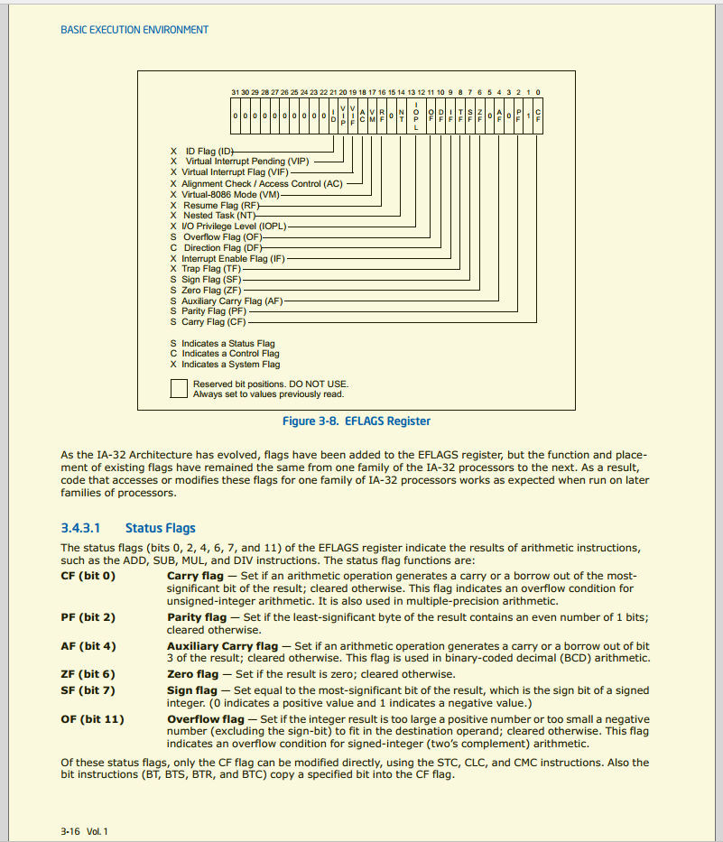

# 6.1 常见标志寄存器简介

## FLAGS

标志寄存器，用于反映 CPU 的状态和运算结果的某些特征，提供状态标志(条件标志)、控制标志和系统标志。

- 条件标志：OF, SF, ZF, AF, PF, CF.
- 控制标志：DF.
- 系统标志：IF, TF, IOPL, NT, RF, VM, AC, VIF, VIP, ID.

### IA-32

可以使用所有 EFLAGS 提供的标志位。

### IA-16

EFLAGS 的 低 16 位 即为 FLAGS，只能使用 FLAGS 提供的标志位。每个标志位一般在 EFLAGS 中使用 1 位二进制的取值表示某个含义。

### 具体的各标志寄存器的的定义

不废话，直接上图。图片来自 Intel® 64 and IA-32 Architectures Developer's Manual Rev.201609 ，访问日期为 2018-09-05。

## 条件标志

上一部分看懂英文的可以直接跳到下一节了。

条件标志：

- 进位标志 CF：运算过程是否有进/借位？有 = 1，否则 = 0；
- 奇偶标志 PF：运算结果最低字节中有偶/奇数个1？偶数 = 1，否则 = 0；
- 辅助进位标志 AF：运算是否有辅助 进/借位？有 = 1，否则 = 0；
- 辅助进/借位：低半字节向高半字节的进位或借位
    零标志 ZF ：运算结果是否为0？是 = 1，否则 = 0；
- 符号标志 SF：运算结果是正/负数？正数 = 0，否则 = 1；
- 溢出标志 OF：运算是否溢出？是 = 1，否则 = 0。(OF == 1时运算一定出现了错误)

## 控制标志

上一部分看懂英文的可以直接跳到下一节了。

控制标志：

- 方向标志 DF：执行串指令时串指针递增/递减修改？递增修改 = 1，否则 = 0；
- 陷阱/单步标志 TF：= 1，CPU 单步工作方式； = 0，非单步方式；可用于 Debug 中，单步调试程序；
- 中断允许标志 IF：= 1，响应外部可屏蔽中断； = 0，不响应外部可屏蔽中断；

中断：指当出现需要时，CPU暂时停止当前程序的执行转而执行处理新情况的程序和执行过程。
