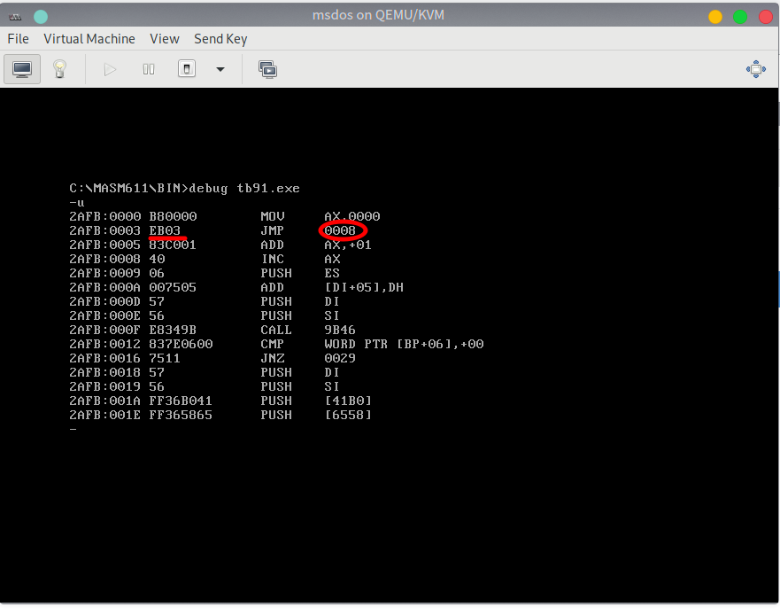
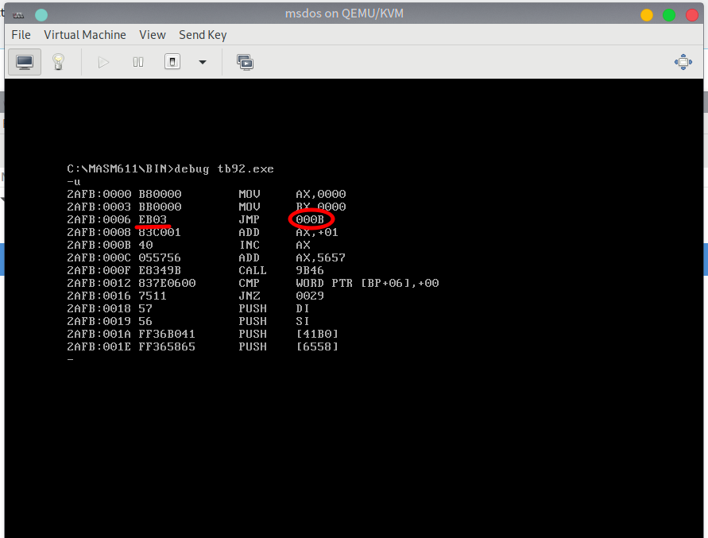

# 5.2 转移指令(2): JMP

## JMP 无条件转移指令

JMP，无条件转移指令，可以修改 CS 和 IP, JMP 指令需要给出两种信息：

 - 转移的目的地址
 - 转移的距离（段间转移，段内短转移，段内近转移）
 
## 执行 JMP 转移指令的基本原理





仔细观察这两张图片，你发现了什么？

> 除了 JMP 指令之外，其他的指令都提供了需要处理的数据或地址对应的 IDATA(立即数)，并在机器码中体现。而图中不同的两条特定的 JMP 指令，机器码相同。`JMP 0008` 和 `JMP 000B` 的 机器码都是 `EB 03`。也就是说，这个机器码中没有包含目的地址。

没有目的地址，那 CPU 根据什么进行转移呢？转移到哪里呢？

我们先来回顾一下 CPU 读取和执行指令的过程：（以 图2中的程序代码 为例）

1. (CS) == 2AFBH, (IP) == 00006H, CS:IP 指向 EB 03
2. 读取指令对应机器码 EB 03 进入 IR 指令缓冲器
3. (IP) = (IP) + 所读取的指令长度 = (IP) + 2 = 00008H，CS:IP 指向 `add ax,1`
4. CPU 执行 IR 指令缓冲器中的指令 EB 03
5. 指令 EB 03 执行后， (IP) == 0000BH, CS:IP 指向 `inc ax`

这样，我们便确定了 CPU 在接收 EB 03 指令后修改了 IP 的值。仔细观察图片，你会发现：CPU 执行 EB 03 之时， (IP)== 00008H，将 IP + 3 ( `EB 03` 中的 03)，正好是 0000BH。
指令 `EB 03` 没有告诉 CPU 应当转移到的目的地址，却告诉了 CPU 应当转移的位移，也就是 3，即将当前的 IP 向后移动 3 个字节。因为图 1、2 中的程序所写的 jmp 指令转移的位移相同，都是向后 3 个字节，所以它们的机器码都是 `EB 03`。

这个位移，由编译器在编译时计算而得，使用补码表示。

> 补码，对于自然数，补码 = 原码，对于负数，补码 = 原码按位取反 + 1。

## JMP 指令的基本应用格式

### 依据位移

`jmp short 标号`，段内短转移，对 IP 的修改范围为 -128～127。指令中的标号是代码段中的标号，指明了指令要转移的目的地，转移指令结束后，CS:IP 应当指向标号处的指令。

实际功能：(IP) = (IP) + 8 位位移

(1) **8 位位移 = 标号处的地址 - jmp 指令后的第一个字节的地址，**
(2) `short` 指明此处的位移 为 8 位位移，补码表示，由编译器在编译时计算而得

`jmp near ptr 标号`，段内近转移，对 IP 的修改范围为 -32768～32767。指令中的标号是代码段中的标号，指明了指令要转移的目的地，转移指令结束后，CS:IP 应当指向标号处的指令。

实际功能：(IP) = (IP) + 16 位位移

(1) **16 位位移 = 标号处的地址 - jmp 指令后的第一个字节的地址，**
(2) `near ptr` 指明此处的位移 为 16 位位移，补码表示，由编译器在编译时计算而得

### 转移的目的地址在指令中

`jmp far ptr 标号` 实现的段间转移，即远转移，指明使用指令用的标号的段地址和偏移地址修改 CS 和 IP。
CS = 标号所在段的段地址 ， IP = 标号在段中的偏移地址。

例如：
```asm6502
assume cs:codesg
codesg segment 
    start:  mov ax,0
            mov bx,0
            jmp far ptr s
            db 256 dup (0)
        s:  add ax,1
            inc ax
codesg ends
end start
```

编译后得到的机器码大致如下（此处直接借用参考教材中的内容）：
```
0BBD:0006 EA 0B 01 BD 0B  JMP 0BBD:010B
```

和数据保存的方法一样，高位地址(`0B BD`)保存高位数据(段地址)，低位地址(`01 0B`)保存低位数据(偏移地址)。

> 对于 `jmp X 标号` 的深入分析请参看参考本书 [附注 3](./ref_tb3.md) 。

### 转移的目的地址在寄存器中

`jmp <16 bits reg>` ，功能：(IP)==(16 Bits Reg)

### 转移的目的地址在内存中

`jmp word ptr <memory unit addr>` 段内转移。

功能：从内存单元地址处开始存放一个字，为转移的目的偏移地址。

`jmp dword ptr <memory unit addr>` 段间转移。

功能：从内存单元地址处开始存放两个字，高地址处的字为转移的目的段地址，低地址处为转移的目的偏移地址。

(CS)=(内存单元地址+2)
(IP)=(内存单元地址)

```asm6502
mov ax,0123h
mov ds:[0],ax
mov word ptr ds:[2],0
jmp dword ptr ds:[0]
```


